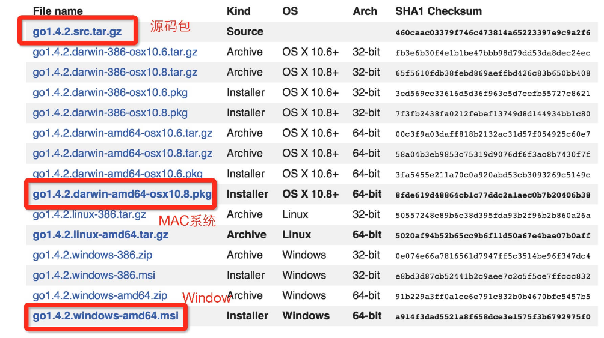
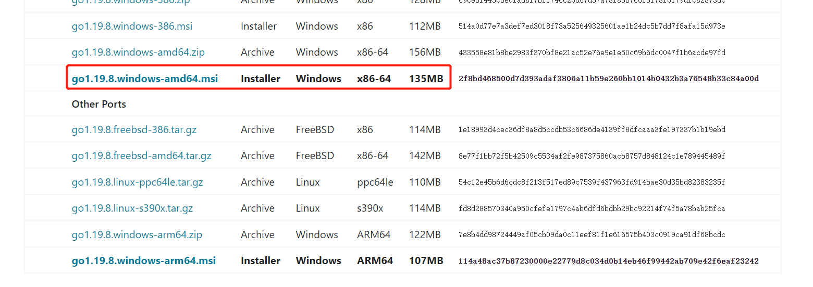
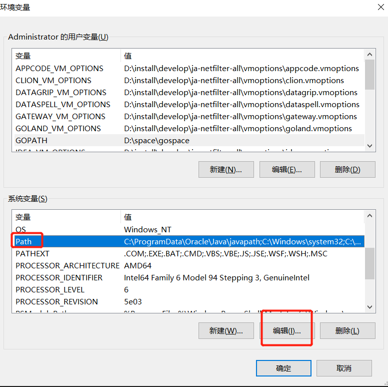

# Go语言环境搭建

下载安装包

```text
安装包下载地址为：https://golang.org/dl/
如果打不开可以使用这个地址：https://golang.google.cn/dl/
```



## Windows



Windows 下可以使用 .msi 后缀(在下载列表中可以找到该文件，如go1.4.2.windows-amd64.msi)的安装包来安装。

默认情况下 .msi 文件会安装在 c:\Go 目录下。
你可以将 c:\Go\bin 目录添加到 Path 环境变量中。添加后你需要重启命令窗口才能生效。

```text
//安装目录
D:\install\Go\

go version

```

```text
环境变量配置

GOPATH：GOPATH是一个环境变量，用来表明你写的go项目的存放路径
D:\space\gospace

```




```text
//查看版本及环境信息
go version
go env
```

## 修改配置信息

1.设置代理

`go env -w GOPROXY=https://goproxy.cn,direct`

2.开启go modules

`go env -w GO111MODULE=on`

开启
`go env -w GO111MODULE=auto`

设置为auto模式，项目中有.mod文件就代表开启，没有就不开启

`go env -w GO111MODULE=off`