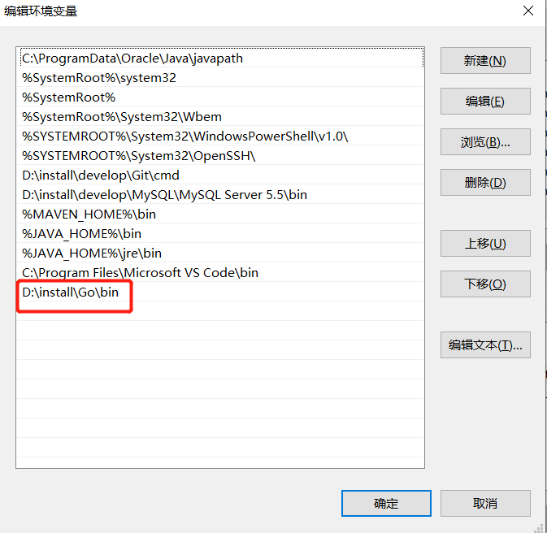

# Go语言环境搭建

- [Go语言环境搭建](#go语言环境搭建)
  - [1.下载安装包](#1下载安装包)
  - [2.安装](#2安装)
    - [2.1 Windows环境](#21-windows环境)
      - [2.1.1 下载并安装](#211-下载并安装)
      - [2.1.2 配置环境变量](#212-配置环境变量)
    - [2.2 Mac环境](#22-mac环境)
      - [2.2.1 下载并安装](#221-下载并安装)
      - [2.2.2 配置环境变量](#222-配置环境变量)
    - [2.3 验证](#23-验证)
  - [3. 修改配置信息](#3-修改配置信息)
  - [4. GOland激活码](#4-goland激活码)

## 1.下载安装包

```text
安装包下载地址为：https://golang.org/dl/
如果打不开可以使用这个地址：https://golang.google.cn/dl/
```


## 2.安装

### 2.1 Windows环境

#### 2.1.1 下载并安装


Windows 下可以使用 .msi 后缀(在下载列表中可以找到该文件，如go1.4.2.windows-amd64.msi)的安装包来安装。

#### 2.1.2 配置环境变量

默认情况下 .msi 文件会安装在 c:\Go 目录下。
你可以将 c:\Go\bin 目录添加到 Path 环境变量中。添加后你需要重启命令窗口才能生效。

```text
//安装目录
D:\install\Go\

go version

```

```text
环境变量配置

GOPATH：GOPATH是一个环境变量，用来表明你写的go项目的存放路径
D:\space\gospace

```




### 2.2 Mac环境

#### 2.2.1 下载并安装

#### 2.2.2 配置环境变量

```shell
vim  ~/.zshrc

# Go
##程序安装的位置
export GOROOT=/usr/local/go
##项目位置
export GOPATH=/Users/zhaocong/Documents/space/gospace
##总的路径
export PATH=$GOROOT/bin:$GOPATH:$PATH
# Go END

#重载配置文件
source ~/.zshrc

```

### 2.3 验证

```text
//查看版本及环境信息
go version
go env
```

## 3. 修改配置信息

1.设置代理

`go env -w GOPROXY=https://goproxy.cn,direct`

2.开启go modules

`go env -w GO111MODULE=on`

开启

`go env -w GO111MODULE=auto`

设置为auto模式，项目中有.mod文件就代表开启，没有就不开启

`go env -w GO111MODULE=off`

其中

- GOROOT：Go的安装目录，（类似于java的JDK） GOPATH：
- GOPATH：是我们的工作空间,保存go项目代码和第三方依赖包
- GOBIN： GO 程序生成的可执行文件（executable file）的路径。

## 4. GOland激活码

账号：lhdjaahelanlan@163.com

密码：Sunday202301291125

作者：IDE激活系列 https://www.bilibili.com/read/cv21468983?from=search